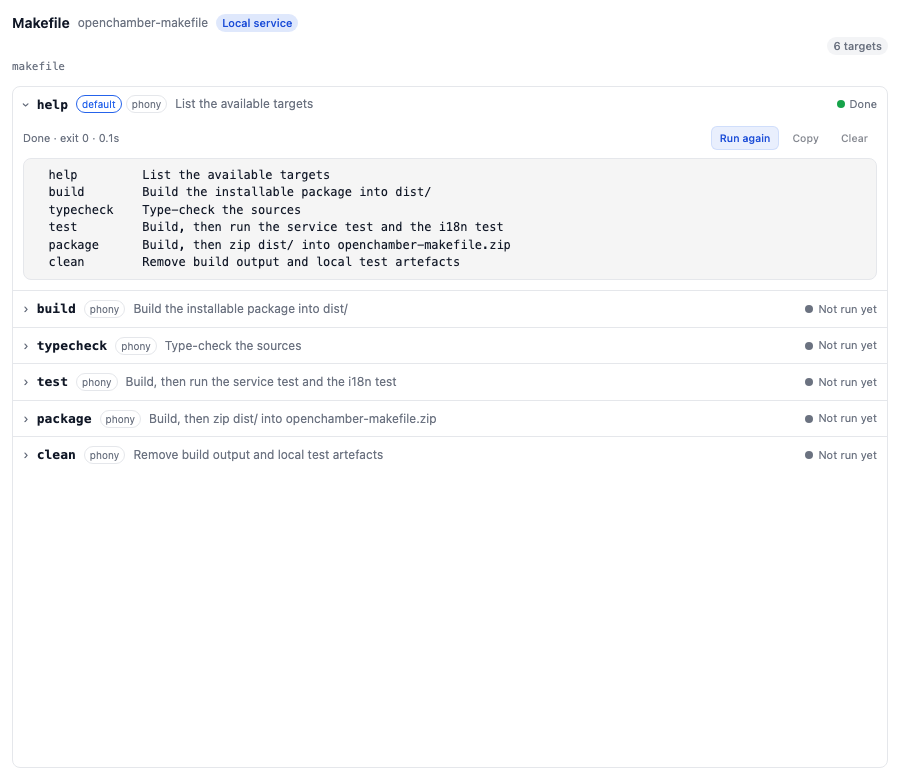

<div align="center">

# OpenChamber Makefile

**在 [OpenChamber](https://openchamber.dev) 里直接运行项目的 Makefile。**
侧栏面板把每个任务列成手风琴，展开即可实时查看 `make` 的运行日志。

[English](./README.md) · 简体中文

[](./LICENSE)
[](https://openchamber.dev)
[](#语言)



</div>

面板会读取当前打开项目的 Makefile，把其中每个任务变成一行可折叠条目。点击某行
即展开，并在首次点击时直接运行 `make <目标>`；输出会持续追加，直到进程结束。

> 这是一个 OpenChamber **扩展**（侧栏面板 + 本地服务），不是 OpenCode 插件。

## 目录

- [功能](#功能)
- [工作原理](#工作原理)
- [安装](#安装)
- [使用](#使用)
- [权限](#权限)
- [已知限制](#已知限制)
- [开发](#开发)
- [语言](#语言)
- [许可证](#许可证)

## 功能

- **一份任务清单** — 按 make 自身的查找顺序读取 `GNUmakefile`、`makefile` 或
  `Makefile`。
- **手风琴条目** — 点击任务即可展开，首次点击同时开始运行。
- **搜索任务** — 在顶部搜索框按名称或说明过滤任务列表。
- **实时输出** — 标准输出与标准错误随运行不断追加。
- **状态一目了然** — 运行中 / 完成 / 失败 / 已停止，结束后显示退出码与耗时。
- **停止、重跑、复制、清空** — 无需离开面板即可控制一次运行。
- **页面关闭也能跑** — 进程由本地服务持有，长时间构建不依赖标签页。
- **面板多语言** — 跟随 OpenChamber 语言（English、简体中文、繁體中文）。
- **不污染项目** — 不向项目写入任何文件，日志只保留在服务内存中。

## 工作原理

iframe 无法启动进程，因此扩展自带一个**本地服务**（`contributes.service`）。
用户批准后由宿主拉起；面板只通过 `serviceRequest` 与它通信。

```
面板 (iframe) --serviceRequest--> 宿主 --127.0.0.1:port--> 服务 --spawn--> make <目标>
```

状态通过**事件流**下发：服务维护一份带序号的事件日志，`GET /events` 以 SSE 帧返回，
暂无事件时挂起等待。

- **命令**（请求/应答）：`GET /targets` 返回任务列表、每个任务最近一次运行与当前事件游标；
  `POST /run` 启动 `make <目标>`；`POST /stop` 先发 `SIGTERM`（若迟迟不退出再发 `SIGKILL`）。
- **事件**（推送）：`run`（开始/结束）、`output`（一段输出）、`targets`（Makefile 变化）。
  面板只开**一条**事件流，逐条应用事件并推进游标，收到应答后立即重连——所有运行共用一条
  连接，而不是每个运行各自轮询。
- **回填**：面板打开前已存在的运行，用一次 `GET /run?offset=&to=` 取回历史输出；此后的新
  输出通过事件下发。
- 若面板落后于缓冲，服务会下发 `reset`，面板重新加载完整状态。

宿主桥接会整包缓冲服务响应（暂不支持流式），所以 `/events` 是"挂起式"而非真正的 socket；
但它就是标准 SSE 帧，将来换成真正的 `EventSource` 无需改动协议。

服务在内存中保留最近 40 次运行，并限制单次运行的输出总量，避免刷屏任务把内存撑爆。
日志不落盘，服务停止后即清空。

## 安装

需要 OpenChamber **2.0.0 或更高版本**（网页版或桌面版）。

1. 打开 **设置 → 扩展**。
2. 在 **文件夹、ZIP 或 URL** 中粘贴以下之一并点击 **添加**：
   - 最新打包的 zip —— 下面的地址始终指向最新构建：
     `https://github.com/open-tecmz/openchamber-makefile/releases/latest/download/openchamber-makefile-latest.zip`
   - 最新 **Releases** 页面上的 `.zip` 文件；
   - 本地克隆的 `dist/` 目录（先执行一次 `make build` 或 `npm run build`）；
   - `release` 分支的 git 地址 ——
     `https://github.com/open-tecmz/openchamber-makefile.git#release`
     （git 安装可在「设置 → 扩展」中 **更新**，只要 `package.json` 版本号变大；
     zip 安装无法自动更新，需手动添加新的 zip）。
3. 在权限弹窗中点击 **允许并启用**。弹窗会列出本地服务，它将以你的完整用户权限运行
   `make`。

## 使用

在侧栏扩展区打开 **Makefile** 面板：

1. 面板会跟随当前打开的项目，列出其中的任务。
2. 在顶部搜索框输入关键词，按名称或说明过滤任务；按 `Esc`（或点 ×）清除搜索。
3. 点击某个任务：该行展开并开始运行 `make <目标>`，日志随运行填充。
4. 用 **停止** 取消，用 **复制** 带走日志，用 **清空** 清空显示，用 **重新运行**
   重跑已完成的任务。

从未运行过的任务在首次点击时开始运行；已运行过的任务先显示上次的输出，需要时再点
**重新运行**。

`contributes.page` 还能把同一面板全屏打开，适合输出量很大的构建。

## 权限

| 能力 | 用途 |
| --- | --- |
| `service` | 本地服务负责读取 Makefile 并启动 `make`；它以你的完整用户权限运行 |

服务声明了 `permissions.exec: ["make"]`，因此权限弹窗会明确说明它打算运行什么。扩展
不申请其他能力：既不读取会话数据，也不访问 Makefile 之外的项目文件。

## 已知限制

- **必须批准本地服务** — 没有它就无法从面板启动进程，面板会明确提示。
- **冷启动** — OpenChamber 按需拉起服务，因此 OpenChamber 进程重启后，面板会先显示
  「连接中」，直到第一次请求把服务带回来。
- **输出有上限** — 单次运行只保留最新约 400 KB 输出，更早的内容会被丢弃，面板会标注
  已被截断。
- **事件流有上限** — OpenChamber 的服务桥对单次代理请求在 20 秒处中断，因此服务将每次
  `/events` 最多挂起 15 秒，面板随即重连。面板请求的是 30 秒挂起时间，服务会将其收敛到
  桥接上限以内。
- **每个任务同时只保留一次运行** — 再次运行会替换上一次的输出。
- **进程无沙箱** — 服务以你的账号权限运行，没有操作系统沙箱，正如权限弹窗所警告的。
- 扩展不支持 VS Code 与移动端。

## 开发

```bash
npm install
make build          # 组装可安装包到 dist/
make typecheck
make test           # 先构建，再运行服务测试与 i18n 测试
```

`npm run build`（或 `make build`）会把完整的可安装包写入 `dist/`：
`dist/package.json`、`dist/icon.svg`、`dist/panel/index.html`，以及两个打包产物
`dist/panel/main.js`（浏览器 IIFE）与 `dist/service/main.js`（Node ESM）。宿主会
按包内位置直接加载已构建的 `.js`，因此页面与其产物必须位于同一目录。`dist/` 为生成
产物，**不提交**；CI 会在每次推送到 `main` 时构建它。

开发时可用文件夹方式安装 `dist/`（设置 → 扩展）：它直接从你的文件夹运行，改完重新
构建再重载即可。

宿主不会编译扩展：只发布已构建文件。修改 `src/i18n.ts` 并重新构建即可新增语言。这
些是本项目仅有的 `devDependencies`；不会打包任何 `node_modules`。完成前请在
`changelog.md` 中记录每一处变更 —— 仓库规则见 `AGENTS.md`。

## 语言

面板跟随 OpenChamber 语言，找不到时回退到英文。面板文案内置 `en`、`zh-cn`、
`zh-tw`；在 `src/i18n.ts` 的 `DICTIONARIES` 中新增一段即可添加语言 —— 字典类型会
让缺失的键在编译期报错。文档提供英文（[README.md](./README.md)）与简体中文
（本文件）。

## 许可证

[Apache-2.0](./LICENSE)。
